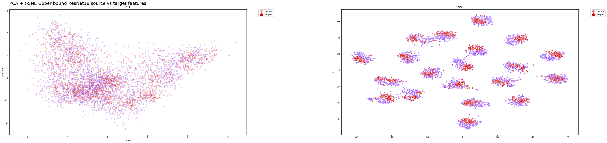
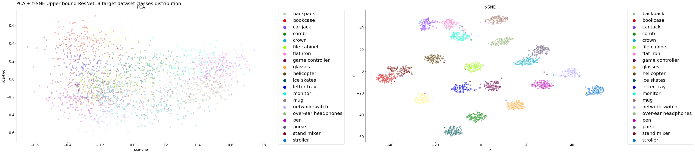
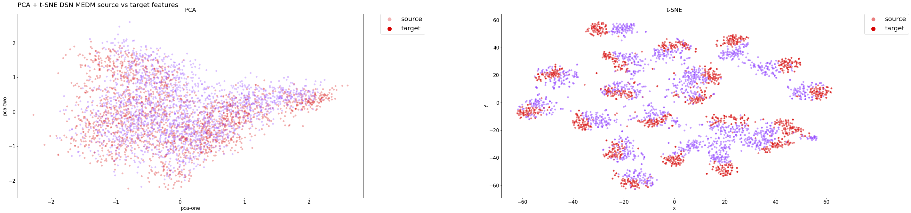

# UDA

`UDA` is a collection of methods concerning [unsupervised domain adaptation](https://en.wikipedia.org/wiki/Domain_adaptation) techniques, developed for the Deep Learning course of the master's degree program in Computer Science at the University of Trento.

The dataset employed is the [Adaptiope](https://ieeexplore.ieee.org/document/9423412) unsupervised domain adaptation benchmark, considering only *few classes* and *only two domains* for the sake of simplicity of the project.

To simplify the task the domains considered are `product` and `real world` whose chosen categories are: *backpack, bookcase, car jack, comb, crown, file cabinet, flat iron, game controller, glasses, helicopter, ice skates, letter tray, monitor, mug, network switch, over-ear headphones, pen, purse, stand mixer and stroller*.

Here we link the wandb [experiments' learning curves](https://wandb.ai/deep-learning-project/dl-project) and the [Jupyter notebook](uda/notebook/notebook.ipynb).

> **Note:** more information can be found in the `report`

## Authors

|  Name    |  Surname   |     Username        |
| :------: | :--------: | :-----------------: |
| Samuele  | Bortolotti | `samuelebortolotti `|
| Luca     | De Menego  | `lucademenego99`    |

## About

The objective of the repository is to devise, train and evaluate a deep learning framework on an **Unsupervised Domain Adaptation** setting.

The test dataset on which the proposed methods are tested is the [Adaptiope](https://openaccess.thecvf.com/content/WACV2021/papers/Ringwald_Adaptiope_A_Modern_Benchmark_for_Unsupervised_Domain_Adaptation_WACV_2021_paper.pdf), a large scale, diverse UDA dataset with 3 domains: synthetic, product and real world data.

The implemented networks will be trained:
- in a supervised way on the source domain;
- in an unsupervised way on the target domain.

The **gain**, namely the amount of improvement we receive when we use the domain adaption framework compared to the outcome we get without any domain alignment approach, is used to assess the quality of the domain alignment strategy. The gain can be represented mathematically as: 

$$G = acc_{uda} − acc_{so}$$

This has been be done in both directions between the two selected domains, using as evaluation metric the **validation accuracy** on the target domain:

$$Accuracy = \frac{T_P + T_N}{T_P + T_N + F_P + F_N}$$

Where:

- $TP$ stands for true positives, namely cases in which the algorithm correctly predicted the positive class
- $TN$ stands for true negatives, namely cases in which the algorithm correctly predicted the negative class
- $FP$ stands for false positives, namely cases in which samples are associated with the positive class whereas they belong to the negative one. (Also known as a "Type I error.")
- $FN$ stands for false negatives, namely cases in which samples are associated with the negative class whereas they belong to the positive one. (Also known as a "Type II error.")

Eventually lower and upper bounds will be calculated training the networks only on one specific domain (source domain for alower bound, target domain for an upper bound), enabling us to provide some considerations about the achievements of our architectures.

### Domain Adaptation background

Just to give a formal background, we leverage on the definition of Domain Adaptation provided by [Gabriela Csurka et.al](https://arxiv.org/pdf/1702.05374.pdf) which in the following sub-section will be presented.

We define a domain $D$ as a d-dimensional feature space $X \in \mathcal{R}^d$ based on a marginal probability distribution $P(X)$, and a task $T$ is defined as a conditional probability distribution $P(Y|X)$ where $Y$ is the label space. 

Given sample set $X = \{x_1, \cdots x_n\}$ of $X$ and their corresponding labels $Y = \{y_1, \cdots y_n\}$ from $Y$. 
In general, these feature-label pairings $\{x_i, y_i\}$ may be used in order to learn the probability distribution $P(Y|X)$ in a supervised way.

Let us assume we have two domains with their related tasks: a source domain $D_s = {X_s, P(X_s)}$ with $T_s = {Y_s, P(Y_s|X_s)}$ and a target domain $Dt = {X_t, P(X_t)}$ with $T_t = {Y_t, P(Y_t|X_t)}$. 

If the two domains corresponds, namely $D_s = D_t$ and $T_s = T_t$, traditional machine learning methods can be used to solve the problem, where $D_s$ becomes the training set and $D_t$ the test set.

However, this assumption is violated, $D_t \neq D_s$ or $T_t \neq T_s$, the models trained on $D_s$ might perform poorly on $D_t$, or they are not applicable directly if $T_t \neq T_s$. Futhermore, when the source domain is related to the target, it is possible to exploit the related information from $\{D_s, T_s\}$ to learn $P(Y_t|X_t)$. This process is known as **transfer learning**.

**Domain Adaptation**, usually refers to problems in which the tasks are considered to be the same ($T_t = T_s$), but the domain is different ($D_s = T_s$).

In a classification task, both the set of labels and the conditional distributions are assumed to be shared between the two domains, i.e. $Y_s = Y_t$ and $P(Y|X_t) = P(Y|X_s)$. 

The second assumption, $P(Y|X_t) = P(Y|X_s)$, is, however, fairly strong and does not always hold in real-world applications.
As a result, the definition of domain adaptation is simplified to simply need the first assumption, namely that $Y_s = Y_t = Y$.

Furthermore, the Domain Adaptation community distinguishes between the unsupervised scenario, in which labels are only accessible for the source domain, and the semi-supervised condition, in which only a limited number of target samples are labeled.

### Proposed solutions

When dealing with **Deep Domain Adaptation** problems, there are three main ways to solve them:

1. **discrepancy-based methods**: align domain data representation with statistical measures;
2. **adversarial-based methods**: involve also a domain discriminator to enforce domain confusion;
3. **reconstruction-based methods**: use an auxiliary reconstruction task to ensure a domain-invariant feature representation.

The repository contains a possible solution for each one of the methods depicted above, together with a customized solution which combines two of them: discrepancy-based and reconstruction-based (`DSN` + `MEDM`).

Having only few examples available, training a network from scratch has not given satisfactory results; that is the reason why we have decided to always start with a feature extractor pre-trained on the [ImageNet](https://ieeexplore.ieee.org/document/5206848) object recognition dataset.

Moreover, in order to delve into the proposed methods, we have given the opportunity to evaluate the domain adaptation method starting from two different backbones networks, namely [AlexNet](https://proceedings.neurips.cc/paper/2012/file/c399862d3b9d6b76c8436e924a68c45b-Paper.pdf) and [ResNet18](https://arxiv.org/abs/1512.03385?context=cs).

### Network Architectures

To successfully meet the domain adaptation challenge, we have implemented several network architectures which are then adopted from relevant papers in the literature and altered to fit our needs.

Our major goal, as stated in the introduction, is to evaluate the performance (gain) of some of the most significant approaches in the domain adaptation field and build them on top of two of the most relevant convolutional neural network architectures, namely `AlexNet` and `ResNet`.

In this repository we cover:
- [Deep Domain Confusion Networks](https://arxiv.org/abs/1412.3474)
- [Domain Adversarial Neural Network](https://arxiv.org/abs/1505.07818)
- [Domain Separation Networks](https://arxiv.org/abs/1608.06019)
- [Rotation loss Network](https://arxiv.org/pdf/2010.07539.pdf)
- [Entropy Minimization vs. Diversity Maximization for Domain Adaptation](https://arxiv.org/pdf/2002.01690.pdf)
- A trial of ours to combine `MEDM` with `DANN`
- Another idea of ours to combine `MEDM` with `DSN`

## Results

In this project we have tried out at least one architecture for each domain adaptation category of techniques, namely `discrepancy-based`, `adversarial-based` and `reconstruction-based`. Among them, the most effective ones were `DANN` and `MEDM`.

`MEDM` is an approach that can be easily integrated in any architecture, since it consists of two simple entropy losses, showing a stable training and astonishing performance. On the other hand, `DANN` is much more subject to hyperparameter variations and it is very likely to end up in an unstable training.

In our testing, we found that `DSN` and `MEDM` worked effectively together, whereas `MEDM` and `DANN` combined have not given a consistent improvement.

Since it's more difficult to adapt from product to real world, gain is significantly simpler to obtain because there is far more space for improvement between the baseline and upper bound.
On the other hand, switching between real world and product images guarantees higher accuracy because networks have already seen real world images since they were pre-trained on `ImageNet`.
As a result, the gap between the baseline and the real world is significantly narrower, which means getting a significant progress is much harder.

After having tried out both `AlexNet` and `ResNet18` as backbone architectures, we found that not only did `ResNet18` have far higher baseline and upper-bound values, but also all domain adaption strategies produced significantly larger gains.

The `t-SNE` plots has clearly shown our last solution is able to extract relevant features from both domains while performing an accurate classification, since the distributions are close to the optimal ones, which are those of the upper bound `ResNet18` model.

### Distribution allignment plots

We have provided some plots to observe how the features of target and source domain are distributed thanks to dimensionality reduction techniques.

Here, for instance, we have shown the `product-to-real-world` domain adaptation, considering only the model that has achieved the best performance, namely `DSN` + `MEDM`. So as to give an effective representation of the distribution alignment and provide a single graph, which is the most significant one regarding our project.

In the following sections two graphs are presented:

- one depicting the distribution of the features learned by backbone neural network (ResNet18 in both cases) without considering the classifier or bottleneck layers.
- one portraying the predicted class distribution.

> **Note**: that in both cases the plots are computed on the target domain (`real-world`), on which the `DSN+MEDM` approach has not access.

Ideally, we would like that our domain adaptation model achieves the performances of the upper-bound model, which is the one that best generalize the source and target domain samples.

Therefore, the model feature distribution is a good method to assess the quality of the domain adaptation technique.

Upper bound features distribution on the test set:



Upper bound classes distribution on the test set:



We expect that both the classes and the features distribution are arranged in a similar way with respect to the Target distributions, as the model has achieved astonishing performances.

`DSN + MEDM` features distribution on the test set:



As we can see from the classes distributions below, even the model's classifier is able to effectively cluster the examples while maintaining a high accuracy. Clusters are well defined and separated between them. Despite being examples of the target domain, they are correctly classified.

`DSN + MEDM` classes distribution on the test set:


In both cases, PCA hasn't really provided useful insights about the results, since a linear transformation may be too naive to transform such high dimensional data into a lower dimensional embedding.

### Performances

Here we provide the results we have achieved on the smaller version of Adaptiope:

| **Backbone Network** | **Method**       | **Source set** | **Target set**    | **Accuracy on target (\%)**          | **Gain** |
|--------------------  |------------------|----------------|-------------------|--------------------------------------|----------|
| AlexNet              | Source Only      | Product Images | Real Life         | 64.45                                | 0        |
| ResNet18             | Source Only      | Product Images | Real Life         | 75.39                                | 0        |
| AlexNet              | Upper Bound      | Product Images | Real Life         | 85.94                                | 21.485   |
| ResNet18             | Upper Bound      | Product Images | Real Life         | 96.88                                | 20.312   |
| AlexNet              | DDC              | Product Images | Real Life         | 68.36                                | 3.91     |
| ResNet18             | DDC              | Product Images | Real Life         | 83.50                                | 8.11     |
| AlexNet              | DANN             | Product Images | Real Life         | 65.23                                | 0.78     |
| ResNet18             | DANN             | Product Images | Real Life         | 87.11                                | 11.72    |
|                      | OriginalDSN      | Product Images | Real Life         | 04.17                                |          |
| AlexNet              | BackboneDSN      | Product Images | Real Life         | 58.85                                | -5.60    |
| ResNet18             | BackboneDSN      | Product Images | Real Life         | 78.39                                | 3.00     |
| ResNet18             | OptimizedDSN     | Product Images | Real Life         | 81.25                                | 5.86     |
| ResNet18             | Rotation Loss    | Product Images | Real Life         | 73.83                                | -1.56    |
| ResNet18             | MEDM             | Product Images | Real Life         | 90.36                                | 14.97    |
| ResNet18             | MEDM + DANN      | Product Images | Real Life         | 80.21                                | 4.82     |
| ResNet18             | MEDM + DSN       | Product Images | Real Life         | 91.15                                | 15.76    |
| AlexNet              | Source Only      | Real Life      | Product Images    | 85.55                                | 0        |
| ResNet18             | Source Only      | Real Life      | Product Images    | 93.75                                | 0        |
| AlexNet              | Upper Bound      | Real Life      | Product Images    | 95.70                                | 10.15    |
| ResNet18             | Upper Bound      | Real Life      | Product Images    | 98.05                                | 4.3      |
| AlexNet              | DDC              | Real Life      | Product Images    | 82.03                                | -3.52    |
| ResNet18             | DDC              | Real Life      | Product Images    | 94.53                                | 0.78     |
| AlexNet              | DANN             | Real Life      | Product Images    | 83.98                                | -1.57    |
| ResNet18             | DANN             | Real Life      | Product Images    | 96.09                                | 2.34     |
|                      | OriginalDSN      | Real Life      | Product Images    | 04.17                                |          |
| AlexNet              | BackboneDSN      | Real Life      | Product Images    | 84.11                                | -1.44    |
| ResNet18             | BackboneDSN      | Real Life      | Product Images    | 91.41                                | -2.34    |
| ResNet18             | OptimizedDSN     | Real Life      | Product Images    | 93.49                                | -0.26    |
| ResNet18             | Rotation Loss    | Real Life      | Product Images    | 91.80                                | -1.95    |
| ResNet18             | MEDM             | Real Life      | Product Images    | 97.14                                | 3.39     |
| ResNet18             | MEDM + DANN      | Real Life      | Product Images    | 94.00                                | 0.25     |
| ResNet18             | MEDM + DSN       | Real Life      | Product Images    | 96.61                                | 2.86     |

## Requirements

The code as-is runs in Python 3.7 with the following dependencies

- [torch](https://pytorch.org/)
- [torchvision](https://github.com/pytorch/vision)
- [wandb](https://wandb.ai/)
- [matplotlib](https://matplotlib.org/)
- [seaborn](https://seaborn.pydata.org/)

And the following development dependencies

- [Sphinx](https://www.sphinx-doc.org/en/master/)
- [black](https://black.readthedocs.io/en/stable/)

## Getting Started

Follow these instructions to set up the project on your PC.

Moreover, to facilitate the use of the application, a Makefile has been provided; to see its functions, simply call the appropriate help command with [GNU/Make](https://www.gnu.org/software/make/)

 ```bash
 make help
 ```

### 1. Clone the repository

 ```bash
 git clone https://github.com/samuelebortolotti/uda.git
 cd uda
 ```

### 2. Install the requirements

```bash
pip install --upgrade pip
pip install -r requirements.txt
```

> **Note**: it might be convenient to create a virtual enviroment to handle the dependencies.
> 
> The `Makefile` provides a simple and convenient way to manage Python virtual environments (see [venv](https://docs.python.org/3/tutorial/venv.html)).
> In order to create the virtual enviroment and install the requirements be sure you have the Python 3.7 (it should work even with more recent versions, however I have tested it only with 3.7)
> ```bash
> make env
> source ./venv/uda/bin/activate
> make install
> ```
> Remember to deactivate the virtual enviroment once you have finished dealing with the project
> ```bash
> deactivate
> ```

### 3. Generate the code documentation

The automatic code documentation is provided [Sphinx v4.5.0](https://www.sphinx-doc.org/en/master/).

In order to have the code documentation available, you need to install the development requirements

```bash
pip install --upgrade pip
pip install -r requirements.dev.txt
```

Since Sphinx commands are quite verbose, I suggest you to employ the following commands using the `Makefile`.

```bash
make doc-layout
make doc
```

The generated documentation will be accessible by opening `docs/build/html/index.html` in your browser, or equivalently by running

```bash
make open-doc
```

However, for the sake of completness one may want to run the full Sphinx commands listed here.

```bash
sphinx-quickstart docs --sep --no-batchfile --project unsupervised-domain-adaptation --author "Samuele Bortolotti, Luca De Menego"  -r 0.1  --language en --extensions sphinx.ext.autodoc --extensions sphinx.ext.napoleon --extensions sphinx.ext.viewcode --extensions myst_parser
sphinx-apidoc -P -o docs/source .
cd docs; make html
```

> **Note**: executing the second list of command will lead to a slightly different documentation with respect to the one generated by the `Makefile`.
> This is because the above listed commands do not customize the index file of Sphinx. This is because the above listed commands do not customise the index file of Sphinx.

### 4. Prepare the dataset 

To prepare the Adaptiope dataset filtered out, you can type:

```bash
python -m uda dataset [--classes ADDITIONAL_CLASSES --destination-location DATASET_DESTINATION_LOCATION --new-dataset-name FILTERED_DATASET_NAME]
```

where `classes` is the list of additional classes to filter out, by default they are:

```python
classes = [
    "backpack",
    "bookcase",
    "car jack",
    "comb",
    "crown",
    "file cabinet",
    "flat iron",
    "game controller",
    "glasses",
    "helicopter",
    "ice skates",
    "letter tray",
    "monitor",
    "mug",
    "network switch",
    "over-ear headphones",
    "pen",
    "purse",
    "stand mixer",
    "stroller",
]
```

`destination_location` refers to the name of the `zip` folder of the Adaptiope dataset which will be downloaded automatically by the script; whereas `new-dataset-name` is the name
of the new filtered dataset folder. 

Alternatively, you can obtain the same result in a less verbose manner by tuning the flags in the `Makefile` and then run:

```bash
make dataset
```

### 5. Visualize the dataset

To have a simple overview of how a label in the dataset looks like you can type:

```bash
python -m uda visualize DATASET_SOURCE DATASET_DEST LABEL [--batch-size BATCH_SIZE]
```

where `DATASET_SOURCE` is the source dataset folder, `DATASET_DEST` is the destination dataset location and `LABEL` is the label of the data you want the script to display.

As an effective representation the command:

```bash
python -m uda visualize adaptiope_small/product_images adaptiope_small/real_life 8
```

gives the following result:


Alternatively, you can obtain the same result in a less verbose manner by tuning the flags in the `Makefile` and then run:

```bash
make visualize
```

> **Note:** by default the `adaptiope_small/product_images`, `adaptiope_small/real_life` and `8` respectively as `SOURCE_DATASET`, `TARGET_DATASET` and `LABEL` will be employed, to override them you can refer to the following commmand:
> ```bash
> make visualize SOURCE_DATASET=sample/real TARGET_DATASET=sample/fake LABEL=9
> ```

The main idea behind the working behaviour of the visualization is very simple since it extracts one random batch from both domains and looks for the images with the specified labels within it. 

Therefore, **there may be some cases in which the images with the wanted label are not contained and thus not shown**, in this scenario I suggest you to increase the batch size or to run again the command.

We know that this functionality is limited and very naive but for our purposes it is more than enough.

### 6. Run an experiment

To run the unsupervised domain adaptation experiment you can type:

```bash
python -m uda experiment POSITIONAL_ARGUMENTS [OPTIONAL_ARGUMENTS]
```

whose arguments can be seen by typing:

```bash
python -m uda experiment --help
```

which are:

```bash
positional arguments:
  {0,1,2,3,4,5,6,7,8,9}
                        which network to run, see the `Technique` enumerator in `uda/__init__.py` and select the one
                        you prefer
  source_data           source domain dataset
  target_data           target domain dataset
  exp_name              name of the experiment
  num_classes           number of classes [default 20]
  pretrained            pretrained model
  epochs                number of training epochs
  {alexnet,resnet}      backbone network

optional arguments:
  -h, --help            show this help message and exit
  --wandb WANDB, -w WANDB
                        employ wandb to keep track of the runs
  --device {cuda,cpu}   device on which to run the experiment
  --batch-size BATCH_SIZE
                        batch size
  --test-batch-size TEST_BATCH_SIZE
                        test batch size
  --learning-rate LEARNING_RATE
                        learning rate
  --weight-decay WEIGHT_DECAY
                        sdg weight decay
  --momentum MOMENTUM   sdg momentum
  --step-decay-weight STEP_DECAY_WEIGHT
                        sdg step weight decay
  --active-domain-loss-step ACTIVE_DOMAIN_LOSS_STEP
                        active domain loss step
  --lr-decay-step LR_DECAY_STEP
                        learning rate decay step
  --alpha-weight ALPHA_WEIGHT
                        alpha weight factor for Domain Separation Networks
  --beta-weight BETA_WEIGHT
                        beta weight factor for Domain Separation Networks
  --gamma-weight GAMMA_WEIGHT
                        gamma weight factor for Domain Separation Networks
  --save-every-epochs SAVE_EVERY_EPOCHS
                        how frequent to save the model
  --reverse-domains REVERSE_DOMAINS
                        switch source and target domain
  --dry DRY             do not save checkpoints
  --project-w PROJECT_W
                        wandb project
  --entity-w ENTITY_W   wandb entity
  --classes CLASSES [CLASSES ...], -C CLASSES [CLASSES ...]
                        classes provided in the dataset, by default they are those employed for the project
```

where `technique` refers to:

```python
class Technique(Enum):
    r"""
    Technique enumerator.
    It is employed for letting understand which method to use
    in order to train the neural network
    """
    SOURCE_ONLY = 1  # Train using only the source domain
    UPPER_BOUND = 2  # Train using the target domain too, to fix an upper bound
    DDC = 3  # Deep Domain Confusion
    DANN = 4  # Domain-Adversarial Neural Network
    DSN = 5  # Domain Separation Network
    ROTATION = 6  # Rotation Loss
    MEDM = 7  # Entropy Minimization vs. Diversity Maximization
    DANN_MEDM = 8  # DANN with Entropy Minimization vs. Diversity Maximization
    DSN_MEDM = 9  # DSN with MEDM
```

As an effective representation the command:

```bash
python -m uda experiment 7 adaptiope_small/product_images adaptiope_small/real_life "trial" 20 pretrained 20 resnet
```
which will produce something similar to the following result:


Alternatively, you can obtain the same result in a less verbose manner by tuning the flags in the `Makefile` and then run:

```bash
make experiment
```

> **Note:**  The current behavior is equivalent to 
> ```bash
> python -m uda 7 adaptiope_small/product_images adaptiope_small/real_life "medm" 20 pretrained 20 resnet --learning-rate 0.001 --batch-size 32 --test-batch-size 32 
> ```
> you can change the behaviour by passing the parameters to the `Makefile` or by modifying its variables directly.

## Jupyter Notebook

If you are interested in running all the experiments we have performed at once, we suggest you to execute the jupyter notebook [in the repository](uda/notebook/notebook.ipynb).

Such notebook has been run on [Google Colab](https://colab.research.google.com), therefore you can effortless run it from there as a powerful enough GPU and all the required libraries are provided.

### Prepare the dataset

If you are willing to run the notebook be sure you have a copy of the zip archive of the Adaptiope dataset, which is available [here](https://gitlab.com/tringwald/adaptiope), placed in your Google Drive folder inside a directory called `datasets`.

Practically speaking, the notebook will try to filter out the Adaptiope dataset by accessing `My Drive/datasets/Adaptiope.zip` after having established a connection to your Google Drive storage.
